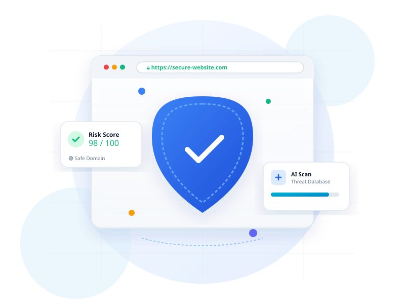

# URL Safety Checker – AI-Powered Website Security Analyzer & Operations Dashboard

A professional, modern, and fully responsive SaaS cybersecurity platform designed to evaluate website safety, detect phishing threats, analyze URL entropy, inspect SSL protocols, manage analyst authentication, and query threat intelligence databases.



---

## 🌟 Key Features

- **Analyst Authentication System**: Sign In, Sign Up, session persistence (`localStorage`), user avatar dropdown menu, and a **One-Click Instant Demo Login** for effortless previewing.
- **Executive Operations Dashboard**:
  - Live KPI metrics cards (Total Audits Performed, Blocked Threats, Safe Domain Ratio %, Monthly API Quota).
  - Visual Risk Distribution Bar (Safe vs Suspicious vs Malicious).
  - Real-time Threat Telemetry Feed.
  - Custom Whitelist / Blacklist Domain Rules Manager.
  - Analyst Security Preferences & Alert Toggles.
- **Light SaaS Cybersecurity Theme**: Styled with a clean white/light-gray background, blue primary accents, status indicators (Green, Yellow, Red), 16–20px rounded glass cards, soft drop shadows, and modern typography (`Inter` & `Poppins`).
- **Heuristic Security AI Engine**: Evaluates domain entropy, protocol SSL status, raw IP hostnames, brand impersonation/typosquatting, URL length, and suspicious phishing keywords.
- **Threat Intelligence Feeds**: Integrated simulation & API key support for **Google Safe Browsing**, **VirusTotal Engine**, **PhishTank**, and **URLhaus Malware Feeds**.
- **Interactive Security Dashboard**:
  - SVG Circular Score Gauge (0 to 100) with animated counting meter.
  - Risk Level Badges (`🟢 SAFE`, `🟡 SUSPICIOUS`, `🔴 MALICIOUS`).
  - Detailed inspection breakdown checklist.
  - Domain metadata (IP address, protocol, TLD risk, Shannon entropy index).
- **LocalStorage Data Vault**: Stores scan history locally in the browser with live search, risk level filtering, individual record deletion, and JSON export.
- **Executive PDF Report Export**: Printable audit report layout optimized with CSS `@media print`.

---

## 📁 Project Structure

```
URL-Safety-Checker/
│
├── index.html            # Main HTML5 semantic layout with Auth & Dashboard views
├── style.css             # Vanilla CSS design system, glassmorphic theme & print styles
├── script.js            # Heuristics engine, User Auth session & Dashboard manager
│
├── assets/
│   ├── images/
│   │     hero.svg        # Hero section cybersecurity vector illustration
│   │     security.svg    # AI detection vector graphic
│   │     dashboard.svg   # Analytics dashboard graphic
│   │
│   └── icons/
│         shield.svg      # Shield status icon
│         warning.svg     # Alert status icon
│         check.svg       # Pass status icon
│
└── README.md             # Project documentation
```

---

## 🚀 Getting Started

No build tools, compilation, or npm packages are required.

### 1. Open directly in Browser
Double-click `index.html` or open it with any modern web browser (Google Chrome, Microsoft Edge, Mozilla Firefox, Apple Safari).

### 2. Run with Local Web Server
You can also launch a lightweight local HTTP server using Python or Node:

```bash
# Using Python 3
python -m http.server 8080

# Or using Node.js npx http-server
npx http-server . -p 8080
```
Then navigate to `http://localhost:8080`.

---

## 🧠 Threat Detection Rules & Heuristics

ShieldURL evaluates URLs against 6 core security dimensions:

1. **Custom Whitelist/Blacklist Rules**: User-defined domain overrides set via the Executive Dashboard.
2. **Protocol SSL Audit**: Unencrypted `http://` receives a 20-point security penalty.
3. **Raw IP Hostname**: URLs using raw IPv4/v6 hostnames (e.g. `192.168.1.100`) receive a 35-point penalty.
4. **Phishing Keyword Scan**: Scans for sensitive terms (`login`, `bank`, `paypal`, `crypto`, `verify`, `update`, `wallet`).
5. **Brand Impersonation**: Detects lookalike domains (e.g. `paypa1`, `g00gle`, `amaz0n`).
6. **Shannon Entropy Calculation**: Identifies randomized dynamic DGA domains (entropy > 4.0).
7. **Top-Level Domain (TLD) Risk**: Flags high-risk TLD extensions (`.xyz`, `.top`, `.tk`, `.online`, `.click`).
